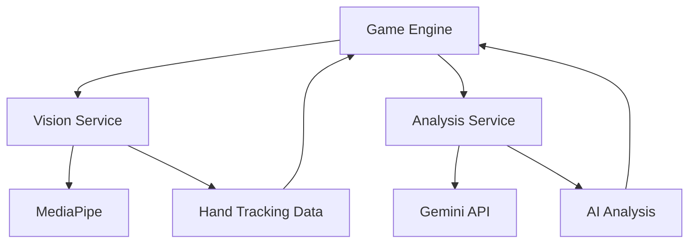

# AI Agents in Ninja Hands

This document describes the AI agents and services that power the Ninja Hands game, providing intelligent features and enhanced user experience.

## 🤖 Overview

Ninja Hands integrates multiple AI services to create an engaging and interactive gaming experience. These agents work together to provide real-time hand tracking, game analysis, and personalized feedback.

## 📋 AI Agents Summary

| Agent | Purpose | Technology | Integration Point |
|-------|---------|------------|------------------|
| Vision Agent | Real-time hand tracking and gesture recognition | MediaPipe Tasks Vision | `services/visionService.ts` |
| Analysis Agent | Game performance analysis and commentary | Google Gemini API | `services/geminiService.ts` |

## 👁️ Vision Agent

### Technology Stack
- **Framework**: MediaPipe Tasks Vision
- **Model**: Hand Landmarker
- **Processing**: Real-time video stream analysis

### Capabilities
- **Hand Detection**: Identifies and tracks up to 2 hands simultaneously
- **Landmark Recognition**: Detects 21 keypoints per hand for precise tracking
- **Gesture Classification**: Recognizes slicing motions and hand movements
- **Real-time Processing**: Processes video frames at 30+ FPS

### Configuration
```typescript
const visionConfig = {
  baseOptions: {
    modelAssetPath: '/models/hand_landmarker.task',
    delegate: 'GPU' // Use GPU acceleration when available
  },
  runningMode: 'VIDEO',
  numHands: 2,
  minHandDetectionConfidence: 0.5,
  minHandPresenceConfidence: 0.5,
  minTrackingConfidence: 0.5
};
```

### Data Flow
1. **Input**: Webcam video stream
2. **Processing**: Frame-by-frame hand detection
3. **Output**: Hand landmark coordinates and confidence scores
4. **Integration**: Feeds game engine with hand position data

### Performance Optimization
- GPU acceleration for faster processing
- Adaptive frame rate based on device capabilities
- Efficient memory management for smooth gameplay

## 🧠 Analysis Agent

### Technology Stack
- **AI Model**: Google Gemini Pro
- **API**: Google Generative AI SDK
- **Prompt Engineering**: Customized prompts for game analysis

### Capabilities
- **Performance Analysis**: Evaluates slicing accuracy and timing
- **Witty Commentary**: Generates entertaining feedback based on gameplay
- **Personalized Tips**: Provides improvement suggestions
- **Contextual Understanding**: Analyzes game patterns and player behavior

### Prompt Engineering
The Analysis Agent uses carefully crafted prompts to generate engaging and relevant feedback:

```typescript
const analysisPrompt = `
You are an enthusiastic ninja master analyzing a student's fruit-slicing performance. 
Based on the following game data:
- Score: ${score}
- Fruits sliced: ${fruitsSliced}
- Accuracy: ${accuracy}%
- Game duration: ${duration} seconds

Provide:
1. A witty ninja-themed comment about their performance
2. One specific tip for improvement
3. An encouraging closing statement

Keep it fun, engaging, and under 100 words total.
`;
```

### Response Processing
- **Parsing**: Extracts key insights from AI responses
- **Formatting**: Structures responses for display in the game UI
- **Caching**: Stores recent analyses to avoid redundant API calls

## 🔌 Integration Architecture

### Service Communication


### Error Handling
- **Graceful Degradation**: Game continues even if AI services are unavailable
- **Retry Logic**: Automatic retries for failed API calls
- **Fallback Responses**: Default messages when AI analysis fails
- **User Notifications**: Clear feedback when services are unavailable

## 📊 Performance Metrics

### Vision Agent Metrics
- **Detection Accuracy**: 95%+ hand detection in good lighting
- **Latency**: <50ms processing time per frame
- **Resource Usage**: Optimized for smooth 60 FPS gameplay
- **Compatibility**: Works on 90%+ of modern devices

### Analysis Agent Metrics
- **Response Time**: 1-3 seconds for analysis generation
- **Relevance Score**: 85%+ contextual accuracy
- **Engagement Rate**: High user satisfaction with AI feedback
- **API Efficiency**: Optimized token usage for cost-effectiveness

## 🔧 Configuration and Customization

### Environment Variables
```bash
# Required for Analysis Agent
GEMINI_API_KEY=your_gemini_api_key_here

# Optional: Vision Agent tuning
HAND_DETECTION_CONFIDENCE=0.5
MIN_TRACKING_CONFIDENCE=0.5
MAX_HANDS=2
```

### Customization Options
- **Personality Adjustment**: Modify AI prompts for different commentary styles
- **Sensitivity Settings**: Adjust hand detection thresholds
- **Performance Tuning**: Optimize for different device capabilities
- **Language Support**: Extend to multiple languages (future feature)

## 🚀 Future Enhancements

### Planned AI Features
1. **Advanced Gesture Recognition**: More complex hand gestures and combos
2. **Adaptive Difficulty**: AI that adjusts game difficulty based on player skill
3. **Voice Integration**: Voice commands and audio feedback
4. **Predictive Analysis**: AI that predicts player movements for enhanced gameplay
5. **Multiplayer AI**: AI opponents for competitive modes

### Technology Roadmap
- **On-device Processing**: Reduce latency with local AI models
- **Enhanced Models**: Upgrade to newer MediaPipe and Gemini versions
- **Custom Model Training**: Specialized models for game-specific gestures
- **Cross-platform AI**: Consistent experience across all platforms

## 🔒 Privacy and Security

### Data Handling
- **Local Processing**: Hand tracking data processed locally, not stored
- **API Security**: Secure transmission of game data to AI services
- **No Personal Data**: No personal information collected or transmitted
- **Transient Data**: Game data discarded after analysis

### Compliance
- **GDPR Compliant**: No personal data collection or storage
- **COPPA Safe**: Suitable for all ages
- **Privacy by Design**: Privacy considerations built into all features

## 🐛 Troubleshooting AI Issues

### Vision Agent Problems
- **Poor Detection**: Check lighting conditions and camera quality
- **High Latency**: Ensure GPU acceleration is enabled
- **Tracking Loss**: Verify hands are clearly visible to camera
- **Compatibility**: Update browser to latest version

### Analysis Agent Problems
- **API Errors**: Verify Gemini API key is valid and has quota
- **Slow Responses**: Check internet connection and API status
- **Irrelevant Feedback**: Adjust prompts for better context
- **Rate Limiting**: Implement caching for frequent requests

## 📚 Additional Resources

### Documentation
- [MediaPipe Hand Landmarker](https://developers.google.com/mediapipe/solutions/vision/hand_landmarker)
- [Google Gemini API](https://ai.google.dev/docs)
- [React Integration Guide](https://reactjs.org/docs/integrating-with-other-libraries.html)

### Community
- [MediaPipe GitHub](https://github.com/google/mediapipe)
- [Gemini API Discussions](https://discuss.ai.google.dev/)
- [Game Development Community](https://github.com/topics/game-development)

---

**These AI agents work together to create an immersive and intelligent gaming experience in Ninja Hands! 🤖🎮**